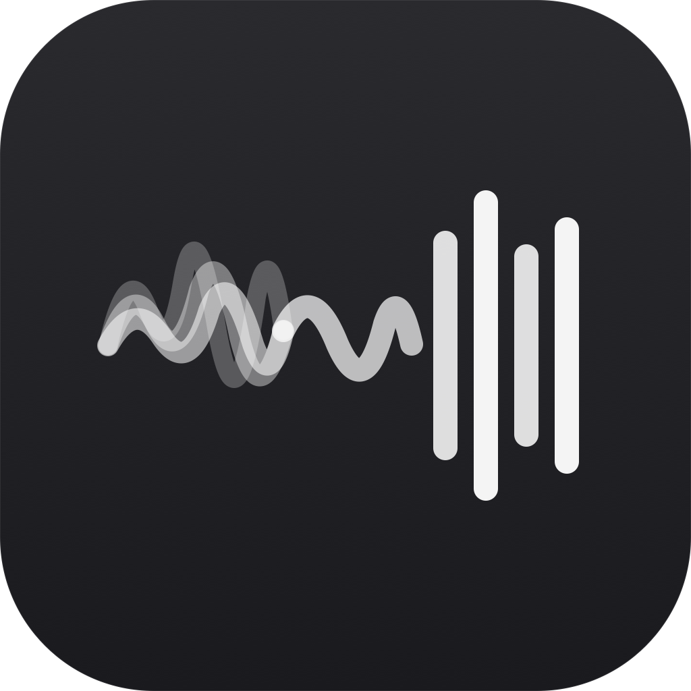

<p align="center">
  
</p>

<h1 align="center">FreeFlow — local-only fork</h1>

<p align="center">
  Free and open source alternative to <a href="https://wisprflow.ai">Wispr Flow</a>, <a href="https://superwhisper.com">Superwhisper</a>, and <a href="https://monologue.to">Monologue</a>.
</p>

---

> **This is a fork of [zachlatta/freeflow](https://github.com/zachlatta/freeflow) by [Zach Latta](https://github.com/zachlatta), currently maintained by [@marcbodea](https://github.com/marcbodea). All credit for the original app goes to them — this fork just swaps in a fully local, Apple-Silicon-native backend (no cloud, no API keys, no subscriptions).**
>
> If you want the easy, no-build experience with Groq cloud transcription, use [the upstream release](https://github.com/zachlatta/freeflow/releases/latest/download/FreeFlow.dmg).

---

## Local-only variant (Apple Silicon only)

**Requirements:** Apple Silicon Mac (M1 or later), macOS 13+, Homebrew.

This fork replaces Groq with two always-on local servers:

| Component | What it does | Runs on |
|---|---|---|
| **mlx-lm** (Qwen 3.5 4B, MLX 4-bit) | Post-processing / cleanup LLM | M-series GPU via Apple MLX |
| **WhisperKit** (large-v3-turbo) | Speech-to-text transcription | Apple Neural Engine |

Both run as launchd agents — they auto-start at login and restart on crash. End-to-end latency: <1 s.

**Resource usage (idle, both servers loaded):**

| | Memory | Disk |
|---|---|---|
| mlx-lm (Qwen 3.5 4B MLX-4bit) | ~2.7 GB | 2.9 GB |
| WhisperKit (large-v3-turbo) | ~360 MB | 608 MB |
| **Total** | **~3.1 GB** | **~3.5 GB** |

Recommended: 16 GB RAM. Works on 8 GB but leaves less headroom for other apps. There's no separate VRAM budget — Apple Silicon uses unified memory, so the LLM weights live in the same pool as regular RAM. WhisperKit runs almost entirely on the Apple Neural Engine, so its memory footprint is minimal.

### Automated setup

```sh
git clone https://github.com/samswede/freeflow
cd freeflow
./setup.sh
```

`setup.sh` will:
1. Check that you're on Apple Silicon
2. `brew install whisperkit-cli`
3. Create a Python venv and install `mlx-lm`
4. Write and load launchd agents for both servers
5. Build and install `/Applications/FreeFlow Dev.app`
6. Wait for both servers to come up and print the FreeFlow settings table

After it finishes, open FreeFlow Dev from the menu bar and paste in the settings it prints.

> **Wizard tip:** In the API Key step, expand **"Advanced Provider Settings"** and set the **Base URL first** (`http://127.0.0.1:11435/v1`) before entering the API key. If you don't, the wizard validates against Groq's servers and rejects `local`.

For full details, troubleshooting, and the recommended custom system prompt for code dictation, see [`CLAUDE.md`](CLAUDE.md).

---

<p align="center">
  
</p>

<p align="center">
  <i>Original FreeFlow by <a href="https://github.com/zachlatta">@zachlatta</a> · maintained by <a href="https://github.com/marcbodea">@marcbodea</a></i>
</p>

## Overview

FreeFlow is a free Mac dictation app inspired by [Wispr Flow](https://wisprflow.ai/), [Superwhisper](https://superwhisper.com/), and [Monologue](https://www.monologue.to/). It gives you fast AI transcription, context-aware cleanup, and voice-driven text editing without a monthly subscription.

## Quick Start

1. Download the app from above or [click here](https://github.com/zachlatta/freeflow/releases/latest/download/FreeFlow.dmg)
2. Get a free Groq API key from [groq.com](https://groq.com/)
3. Hold `Fn` to talk, or tap `Command-Fn` to start and stop dictation, and have whatever you say pasted into the current text field

## Features

- **Custom shortcuts:** Customize both hold-to-talk and toggle dictation shortcuts. If your toggle shortcut extends your hold shortcut, you can start in hold mode and press the extra modifier keys to latch into tap mode without stopping the recording.
- **Context-aware cleanup:** FreeFlow can read nearby app context so names, terms, and phrases are spelled correctly when you dictate into email, terminals, docs, and other apps.
- **Custom vocabulary:** Add names, jargon, and project-specific words that FreeFlow should preserve during cleanup.
- **OpenAI-compatible providers:** Use Groq by default, or configure a custom model and API URL in settings.

## Edit Mode

Edit Mode lets you highlight existing text and transform it with a spoken instruction, like "make this shorter" or "turn this into bullets." Enable it in settings, then use your normal dictation shortcut on selected text, or choose Manual mode to require an extra modifier key.

## Privacy

There is no FreeFlow server, so FreeFlow does not store or retain your data. The only information that leaves your computer are API calls to your configured transcription and LLM provider.

## Custom Cleanup

If you'd rather keep cleanup more literal and less context-aware, you can paste this simpler prompt into the custom system prompt setting:

<details>
  <summary>Simple post-processing prompt</summary>

  <pre><code>You are a dictation post-processor. You receive raw speech-to-text output and return clean text ready to be typed into an application.

Your job:
- Remove filler words (um, uh, you know, like) unless they carry meaning.
- Fix spelling, grammar, and punctuation errors.
- When the transcript already contains a word that is a close misspelling of a name or term from the context or custom vocabulary, correct the spelling. Never insert names or terms from context that the speaker did not say.
- Preserve the speaker's intent, tone, and meaning exactly.

Output rules:
- Return ONLY the cleaned transcript text, nothing else. So NEVER output words like "Here is the cleaned transcript text:"
- If the transcription is empty, return exactly: EMPTY
- Do not add words, names, or content that are not in the transcription. The context is only for correcting spelling of words already spoken.
- Do not change the meaning of what was said.

Example:
RAW_TRANSCRIPTION: "hey um so i just wanted to like follow up on the meating from yesterday i think we should definately move the dedline to next friday becuz the desine team still needs more time to finish the mock ups and um yeah let me know if that works for you ok thanks"

Then your response would be ONLY the cleaned up text, so here your response is ONLY:
"Hey, I just wanted to follow up on the meeting from yesterday. I think we should definitely move the deadline to next Friday because the design team still needs more time to finish the mockups. Let me know if that works for you. Thanks."</code></pre>
</details>

## FAQ

**Why does this use Groq instead of a local transcription model?**

I love this idea, and originally planned to build FreeFlow using local models, but to have post-processing (that's where you get correctly spelled names when replying to emails / etc), you need to have a local LLM too.

If you do that, the total pipeline takes too long for the UX to be good (5-10 seconds per transcription instead of <1s). I also had concerns around battery life.

Some day!

**Update:** You can now use a custom model with FreeFlow by configuring the LLM API URL in the FreeFlow settings to use Ollama. Thank you @taciturnaxolotl!

## License

Licensed under the MIT license.
